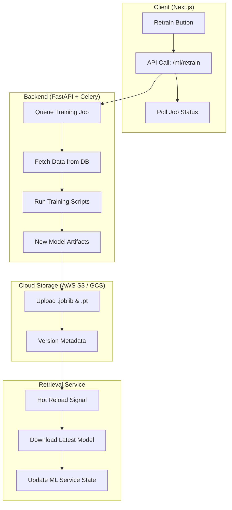

# Implementation Plan - Remote Model Retraining & Cloud Deployment

This plan outlines the steps required to enable model retraining through the website's settings page and the infrastructure needed to store and retrieve these models using cloud services.

## Architecture Overview

The system will transition from local model management to a cloud-native CI/CD pipeline for Machine Learning (MLOps).

## Data Retrieval Strategy

To effectively retrain the models, the background job must pull high-quality historical data. The following dataset schema will be retrieved from the `streetlight_logs` table:

### 1. Essential Features (Inputs)
*   **Raw Sensors**: `voltage`, `current`, `power_consumption`, `light_intensity`, `pwm`.
*   **Calculated Deltas**: `d_voltage`, `d_current`, `d_power`.
*   **Statistical Trends**: `std_voltage_5`, `std_current_5`.
*   **Operational Context**: `operating_hours`, `voltage_fluctuation`, `power_trend`.

### 2. Labels (Supervised Learning Targets)
*   **Classification (Random Forest)**: `fault_type`. This field contains the "ground truth" (e.g., `NORMAL`, `OVERCURRENT`, `LAMP_DEGRADATION`).
*   **Regression (LSTM)**: `timestamp` and `is_on`. These are used to calculate the **Time-To-Failure (TTF)** by measuring the duration until the next recorded fault.

### 3. Query Logic
*   **Temporal Filter**: Retrieve data from the last $N$ months (user-configurable).
*   **Balance Check**: The query should ensure a balanced dataset by oversampling rare fault types (e.g., `SYSTEM_FAILURE`) if necessary.
*   **Data Cleaning**: Exclude logs where `voltage` or `current` are `NULL` or where sensors reported impossible values (e.g., negative light intensity).

## Proposed Changes & Cloud Suggestions

### 1. Cloud Infrastructure: Hugging Face (HF)

To keep the research project cost-effective and ML-native, we will use **Hugging Face** for all external storage needs.

*   **HF Datasets Hub**: Used for storing and versioning the `.csv` logs.
    *   **Versioning**: Leverages Git LFS to track snapshots (e.g., `streetlight_dataset_V1.csv`).
    *   **Accessibility**: Provides direct download links for researchers and allows web-based data previews.
*   **HF Models Hub**: Used for storing trained model artifacts (`.joblib` and `.pt`).
    *   **Model Cards**: Automatically documents accuracy and training parameters for each version.

**Decision**: Hugging Face is the sole provider for both datasets and models due to its superior versioning, free tier (unlimited public), and specialized ML tools.

### 2. Backend Infrastructure (FastAPI)

#### [NEW] `app/api/v1/endpoints/ml.py`
*   **POST `/retrain`**: Triggers the Celery task. Returns a `job_id`.
*   **GET `/status/{job_id}`**: Returns the current progress or completion status.

#### [NEW] `app/tasks/ml_tasks.py`
*   A Celery task that imports and runs functions from `server/machine_learning/random_forest_train.py` and `lstm_train.py`.
*   Handles the export of models and their upload to the chosen cloud storage.

### 3. Retrieval & Hot Reload

#### [MODIFY] [ml_prediction.py](file:///home/johnpatrickparaon/Desktop/Projects/smart-streetlight-research/server/web_server/app/services/ml_prediction.py)
*   Add a method `download_and_reload()` that fetches artifacts from Hugging Face Hub.
*   Implement a background polling mechanism or a Redis-based signal listener to trigger a reload when a new model is available.

#### [NEW] [ml_data_service.py](file:///home/johnpatrickparaon/Desktop/Projects/smart-streetlight-research/server/web_server/app/services/ml_data_service.py)
*   Handles DB extraction and snapshot creation.
*   `export_to_csv(versioned=True)`: Creates a full snapshot (Original + New logs) for auditability.

## Detailed Implementation Steps

### Phase 1: Background Execution
1.  Set up **Celery** with **Redis** in the server environment.
2.  Refactor existing training scripts (`random_forest_train.py` etc.) to be callable as functions.
3.  Implement the `/ml/retrain` endpoint to trigger these functions.

### Phase 2: Hugging Face Integration
1.  Add `huggingface_hub` to `requirements.txt`.
2.  Implement `HuggingFaceService` to handle `push_dataset()` and `push_model()`.
3.  Add `HF_TOKEN` and `HF_REPO` to environment variables.
4.  Update the training job to upload artifacts to the HF Hub upon successful completion.

### Phase 3: Hot Reloading
1.  Add a "Model Version" table to the database to track which model is "Active".
2.  Update `MLPredictionService` to check this table periodically or on-demand.
3.  Ensure thread-safety when replacing the model objects in memory.

## Open Questions
*   **Data Volume**: How much historical data should be used for retraining? (e.g., last 30 days, or all time).
*   **Validation**: Should we automatically deploy the new model if accuracy is higher, or require manual approval?
*   **Compute**: Retraining LSTMs can be resource-intensive. Do we want to run this on the web server or a dedicated worker node?
