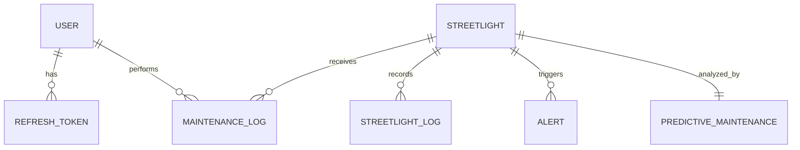

# System Models Documentation

This document outlines the data models required for the Web-Based Smart Streetlight Automation and Predictive Maintenance System. These models are designed to support user management, streetlight monitoring, fault detection, and machine learning-based predictive maintenance.

> [!NOTE]
> This documentation currently focuses on the Backend/Web Server models. The IoT hardware component implementation is not included in this document as it is currently pending.

## 1. Authentication and User Management

### 1.1 User Model

Stores information about the system users and their roles for Role-Based Access Control (RBAC).

| Field             | Type     | Description                                            |
| :---------------- | :------- | :----------------------------------------------------- |
| `id`              | Integer  | Primary Key                                            |
| `username`        | String   | Unique username for login                              |
| `hashed_password` | String   | Encrypted password                                     |
| `role`            | Enum     | User role: `admin`, `operator`, `technician`, `viewer` |
| `is_active`       | Boolean  | Whether the account is active                          |
| `created_at`      | DateTime | Account creation timestamp                             |
| `updated_at`      | DateTime | Last update timestamp                                  |

**Relationships:**

- One-to-Many with `RefreshToken`
- One-to-Many with `MaintenanceLog` (as the technician)

### 1.2 RefreshToken Model

Used for managing secure user sessions and JWT refresh logic.

| Field        | Type     | Description                        |
| :----------- | :------- | :--------------------------------- |
| `id`         | Integer  | Primary Key                        |
| `token`      | String   | The refresh token string           |
| `user_id`    | Integer  | Foreign Key to `User`              |
| `expires_at` | DateTime | Token expiration timestamp         |
| `is_revoked` | Boolean  | Whether the token has been revoked |
| `created_at` | DateTime | Token generation timestamp         |

---

## 2. Streetlight Management

### 2.1 Streetlight Model

Stores metadata and current status of each streetlight node in the system.

| Field               | Type     | Description                                                   |
| :------------------ | :------- | :------------------------------------------------------------ |
| `id`                | Integer  | Primary Key                                                   |
| `name`              | String   | Descriptive name (e.g., "Streetlight A-101")                  |
| `latitude`          | Float    | GPS Latitude for map visualization                            |
| `longitude`         | Float    | GPS Longitude for map visualization                           |
| `model_info`        | String   | Hardware model details                                        |
| `installation_date` | Date     | Date the streetlight was installed                            |
| `status`            | Enum     | Current status: `active`, `inactive`, `faulty`, `maintenance` |
| `is_on`             | Boolean  | Real-time state (ON/OFF)                                      |
| `created_at`        | DateTime | Record creation timestamp                                     |

**Relationships:**

- One-to-Many with `StreetlightLog`
- One-to-Many with `MaintenanceLog`
- One-to-Many with `Alert`
- One-to-One with `PredictiveMaintenance`

### 2.2 StreetlightLog Model

Stores historical sensor data and power usage readings for monitoring and ML training.

| Field               | Type     | Description                  |
| :------------------ | :------- | :--------------------------- |
| `id`                | Integer  | Primary Key                  |
| `streetlight_id`    | Integer  | Foreign Key to `Streetlight` |
| `voltage`           | Float    | Measured voltage (V)         |
| `current`           | Float    | Measured current (A)         |
| `power_consumption` | Float    | Calculated power (W)         |
| `light_intensity`   | Float    | Ambient light level from LDR |
| `timestamp`         | DateTime | Time of measurement          |

---

## 3. Maintenance and Alerts

### 3.1 Alert Model

Stores system-generated alerts for faults or predicted failures.

| Field            | Type     | Description                                                      |
| :--------------- | :------- | :--------------------------------------------------------------- |
| `id`             | Integer  | Primary Key                                                      |
| `streetlight_id` | Integer  | Foreign Key to `Streetlight`                                     |
| `type`           | String   | Alert type (e.g., "Burnout", "Overvoltage", "Predicted Failure") |
| `severity`       | Enum     | `low`, `medium`, `high`, `critical`                              |
| `message`        | Text     | Human-readable alert description                                 |
| `is_resolved`    | Boolean  | Whether the alert has been addressed                             |
| `created_at`     | DateTime | Alert generation timestamp                                       |

### 3.2 MaintenanceLog Model

Records maintenance activities performed on streetlights.

| Field             | Type    | Description                              |
| :---------------- | :------ | :--------------------------------------- |
| `id`              | Integer | Primary Key                              |
| `streetlight_id`  | Integer | Foreign Key to `Streetlight`             |
| `technician_id`   | Integer | Foreign Key to `User` (Role: technician) |
| `description`     | Text    | Details of maintenance work performed    |
| `parts_replaced`  | String  | List of components replaced              |
| `scheduled_date`  | Date    | Date the maintenance was scheduled       |
| `completion_date` | Date    | Date the maintenance was completed       |
| `status`          | Enum    | `pending`, `in_progress`, `completed`    |

---

## 4. Machine Learning Outputs

### 4.1 PredictiveMaintenance Model

Stores the latest results from the Machine Learning predictive model.

| Field                    | Type     | Description                                    |
| :----------------------- | :------- | :--------------------------------------------- |
| `id`                     | Integer  | Primary Key                                    |
| `streetlight_id`         | Integer  | Foreign Key to `Streetlight` (One-to-One)      |
| `failure_probability`    | Float    | Calculated probability of failure (0.0 to 1.0) |
| `predicted_failure_date` | Date     | Estimated date of failure                      |
| `urgency_level`          | Enum     | `low`, `medium`, `high`                        |
| `last_updated`           | DateTime | Last model inference timestamp                 |

---

## 5. Summary of Relationships

> [!TIP]
> Use `STREETLIGHT_LOG` data to train the `PREDICTIVE_MAINTENANCE` models periodically. High `failure_probability` in the predictive model should automatically trigger a `high` severity `ALERT`.
