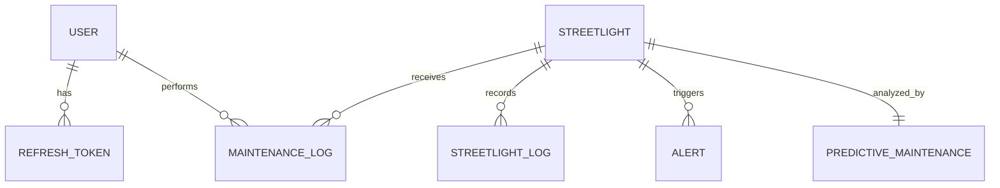

# System Models Documentation

This document defines all current system models for the Web-Based Smart Streetlight Automation and Predictive Maintenance System, including:

- Backend data models (database entities)
- IoT data exchange models (telemetry and control payloads)
- Machine learning models defined in project documents

## 1. Backend Data Models

### 1.1 User Model

Stores account and role information for RBAC.

| Field             | Type     | Description                                             |
| :---------------- | :------- | :------------------------------------------------------ |
| `id`              | Integer  | Primary key                                             |
| `username`        | String   | Unique login username                                   |
| `hashed_password` | String   | Encrypted password hash                                 |
| `role`            | Enum     | `admin`, `operator`, `technician`, `viewer`            |
| `is_active`       | Boolean  | Account status                                          |
| `created_at`      | DateTime | Creation timestamp                                      |
| `updated_at`      | DateTime | Last update timestamp                                   |

**Relationships:**

- One-to-Many with `RefreshToken`
- One-to-Many with `MaintenanceLog` (as technician)

### 1.2 RefreshToken Model

Handles secure session continuation.

| Field        | Type     | Description                        |
| :----------- | :------- | :--------------------------------- |
| `id`         | Integer  | Primary key                        |
| `token`      | String   | Refresh token value                |
| `user_id`    | Integer  | Foreign key to `User`              |
| `expires_at` | DateTime | Expiration timestamp               |
| `is_revoked` | Boolean  | Revocation status                  |
| `created_at` | DateTime | Issued timestamp                   |

### 1.3 Streetlight Model

Stores node metadata and current operational state.

| Field               | Type     | Description                                                   |
| :------------------ | :------- | :------------------------------------------------------------ |
| `id`                | Integer  | Primary key                                                   |
| `name`              | String   | Node name (example: `Streetlight A-101`)                     |
| `latitude`          | Float    | Geo latitude                                                  |
| `longitude`         | Float    | Geo longitude                                                 |
| `model_info`        | String   | Hardware profile (ESP32 + sensor details)                    |
| `installation_date` | Date     | Installation date                                             |
| `status`            | Enum     | `active`, `inactive`, `faulty`, `maintenance`                |
| `is_on`             | Boolean  | Lamp state (relay ON/OFF)                                    |
| `created_at`        | DateTime | Record creation timestamp                                     |

**Relationships:**

- One-to-Many with `StreetlightLog`
- One-to-Many with `MaintenanceLog`
- One-to-Many with `Alert`
- One-to-One with `PredictiveMaintenance`

### 1.4 StreetlightLog Model

Stores historical telemetry readings.

| Field               | Type     | Description                                  |
| :------------------ | :------- | :------------------------------------------- |
| `id`                | Integer  | Primary key                                  |
| `streetlight_id`    | Integer  | Foreign key to `Streetlight`                 |
| `voltage`           | Float    | Voltage reading in volts                     |
| `current`           | Float    | Current reading in amperes                   |
| `power_consumption` | Float    | Computed power in watts                      |
| `light_intensity`   | Float    | LDR/ambient light value                      |
| `timestamp`         | DateTime | Measurement timestamp                        |

### 1.5 Alert Model

Stores fault, threshold, and prediction-based alerts.

| Field            | Type     | Description                                                       |
| :--------------- | :------- | :---------------------------------------------------------------- |
| `id`             | Integer  | Primary key                                                       |
| `streetlight_id` | Integer  | Foreign key to `Streetlight`                                      |
| `type`           | String   | Example: `Overvoltage`, `Overcurrent`, `Predicted Failure`       |
| `severity`       | Enum     | `low`, `medium`, `high`, `critical`                              |
| `message`        | Text     | Alert message                                                     |
| `is_resolved`    | Boolean  | Resolution status                                                 |
| `created_at`     | DateTime | Alert creation timestamp                                          |

### 1.6 MaintenanceLog Model

Stores preventive/corrective maintenance actions.

| Field             | Type    | Description                              |
| :---------------- | :------ | :--------------------------------------- |
| `id`              | Integer | Primary key                              |
| `streetlight_id`  | Integer | Foreign key to `Streetlight`             |
| `technician_id`   | Integer | Foreign key to `User`                    |
| `description`     | Text    | Work performed                           |
| `parts_replaced`  | String  | Replaced components                      |
| `scheduled_date`  | Date    | Scheduled date                           |
| `completion_date` | Date    | Completion date                          |
| `status`          | Enum    | `pending`, `in_progress`, `completed`    |

### 1.7 PredictiveMaintenance Model

Stores latest ML inference output per streetlight.

| Field                    | Type     | Description                                    |
| :----------------------- | :------- | :--------------------------------------------- |
| `id`                     | Integer  | Primary key                                    |
| `streetlight_id`         | Integer  | Foreign key to `Streetlight` (One-to-One)      |
| `failure_probability`    | Float    | Failure risk score from `0.0` to `1.0`         |
| `predicted_failure_date` | Date     | Estimated failure date                          |
| `urgency_level`          | Enum     | `low`, `medium`, `high`                        |
| `last_updated`           | DateTime | Inference timestamp                             |

## 2. IoT Data Exchange Models

### 2.1 TelemetryPayload Model

Represents data sent by each ESP32 node to the backend API.

| Field          | Type      | Required | Description                              |
| :------------- | :-------- | :------- | :--------------------------------------- |
| `node_id`      | String    | Yes      | Unique ESP32/node identifier             |
| `timestamp`    | DateTime  | Yes      | Device sample time                       |
| `light_level`  | Float     | Yes      | LDR reading                              |
| `voltage`      | Float     | Yes      | Voltage reading                          |
| `current`      | Float     | Yes      | Current reading                          |
| `power`        | Float     | Yes      | Computed electrical power                |
| `relay_state`  | Boolean   | Yes      | Current relay state                      |
| `device_status`| String    | Yes      | `online`, `warning`, `fault`, `offline` |

### 2.2 ControlCommand Model

Represents commands issued from dashboard/backend to streetlight nodes.

| Field        | Type     | Required | Description                               |
| :----------- | :------- | :------- | :---------------------------------------- |
| `command_id` | String   | Yes      | Unique command identifier                 |
| `node_id`    | String   | Yes      | Target node ID                            |
| `action`     | Enum     | Yes      | `relay_on`, `relay_off`                   |
| `issued_by`  | Integer  | Yes      | User ID who initiated command             |
| `issued_at`  | DateTime | Yes      | Command creation time                     |
| `status`     | Enum     | Yes      | `queued`, `sent`, `acknowledged`, `failed` |

### 2.3 NodeHeartbeat Model

Represents periodic node health pings for online/offline tracking.

| Field         | Type     | Required | Description                 |
| :------------ | :------- | :------- | :-------------------------- |
| `node_id`     | String   | Yes      | Node identifier             |
| `timestamp`   | DateTime | Yes      | Last heartbeat time         |
| `wifi_rssi`   | Integer  | No       | Wi-Fi signal strength (dBm) |
| `firmware_ver`| String   | No       | Firmware version            |

## 3. Machine Learning Models (Defined)

These are the ML model types defined across the project documents.

### 3.1 Random Forest Model

- **Purpose:** Failure classification for streetlight condition states
- **Library:** Scikit-learn
- **Typical Input Features:** Voltage/current/power trends, light behavior, fault history
- **Output:** Predicted fault class and/or failure risk score

### 3.2 Support Vector Machine (SVM) Model

- **Purpose:** Anomaly detection on electrical behavior patterns
- **Library:** Scikit-learn
- **Typical Input Features:** Normalized voltage/current/power and deviation features
- **Output:** Normal vs anomaly flag (with confidence/proxy score)

### 3.3 LSTM Model

- **Purpose:** Time-series failure prediction from sequential telemetry
- **Library:** TensorFlow or PyTorch
- **Typical Input Features:** Ordered windows of voltage/current/power/light readings
- **Output:** Future failure likelihood and maintenance urgency support

## 4. Relationships Overview

```mermaid
erDiagram
    USER ||--o{ REFRESH_TOKEN : has
    USER ||--o{ MAINTENANCE_LOG : performs
    STREETLIGHT ||--o{ STREETLIGHT_LOG : records
    STREETLIGHT ||--o{ MAINTENANCE_LOG : receives
    STREETLIGHT ||--o{ ALERT : triggers
    STREETLIGHT ||--|| PREDICTIVE_MAINTENANCE : analyzed_by
```

## 5. Implementation Notes

- Backend entities are designed for PostgreSQL with ORM support (SQLAlchemy/Alembic).
- IoT payload models should be validated via FastAPI schema models before persistence.
- ML models should be versioned and tracked in the model registry used by the project workflow.
- High `failure_probability` should auto-create or elevate related `Alert` severity.
