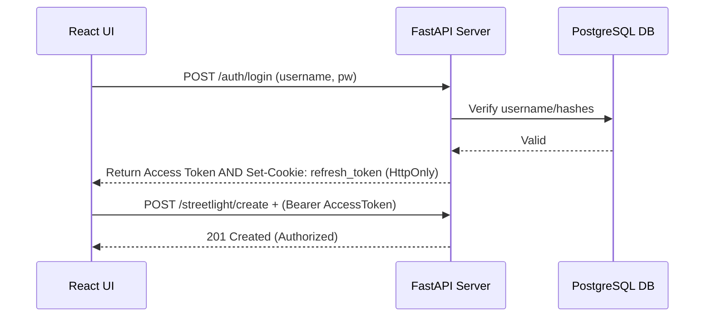

# Agile SDLC Documentation: Smart Streetlight System
**Methodology**: Agile Software Development Life Cycle (SDLC)

## Phase 1: Project Scaffolding & Initial Infrastructure Setup

### 1. User Story & Goal
**Goal**: As a development team, we need to establish the foundational monorepo structure containing the Web Server, Machine Learning (ML) module, and Client Application so that concurrent development tracks can begin without environment collisions.

**User Story**:
> "As a Full-Stack Developer, I want to initialize the independent environments (Frontend, Backend Server, and ML Pipeline) with their baseline dependencies and establish the primary database connection, so that the team can immediately begin parallel feature development in the next sprint."

### 2. Acceptance Criteria
- [x] A unified monorepo directory is structured to clearly separate `client`, `server/web_server`, and `server/machine_learning`.
- [x] Baseline dependencies for Frontend (React/Next.js/Vite), Backend (FastAPI), and ML (Scikit-Learn/PyTorch) are installed.
- [x] The web server successfully connects to the PostgreSQL database on startup without crashing.
- [x] The client application builds and runs a boilerplate starter page.
- [x] A centralized `logs/` directory exists for capturing system output.

### 3. Project Directory Structure
To facilitate a clean separation of concerns, the project utilizes the following directory tree:

```text
smart-streetlight-research/
├── client/                      # Frontend Application
│   ├── src/
│   │   ├── components/
│   │   ├── pages/
│   │   └── App.tsx
│   ├── package.json
│   └── tsconfig.json
├── server/
│   ├── web_server/              # Backend API
│   │   ├── app/
│   │   │   ├── core/            # Config & Database connection
│   │   │   ├── models/          # SQLAlchemy schemas
│   │   │   └── routes/          # API Endpoints
│   │   ├── main.py
│   │   └── requirements.txt
│   ├── machine_learning/        # ML Pipeline & Logs
│   │   ├── models/              # Exported .pt and .joblib artifacts
│   │   ├── logs/                # System training logs
│   │   ├── run_all.py
│   │   └── requirements.txt
└── README.md
```

### 4. Design & Architecture Overview
Because this system requires both high-latency analytics (Machine Learning) and low-latency interaction (Client Dashboard), the framework relies heavily on loose coupling.

1. **Client**: A purely presentation tier built with React. Communicates via RESTful JSON.
2. **Web Server**: Acts as the central traffic controller built with FastAPI. It intercepts telemetry from IoT edge nodes and routes dashboard requests. It utilizes a strict layered pattern (`Router -> Controller -> Service -> Repository`).
3. **ML Module**: An isolated training and inference engine running independently. It yields model artifact files (`.pt` / `.joblib`) which the Web Server can load dynamically during runtime for predictive analytics.

### 5. Implementation Notes & Snippets

#### 5.1 Starter Libraries Installation
Independent environments are required. Below are the commands used to bootstrap the layers:

```bash
# Frontend (Node.js Workspace)
cd client
npm create vite@latest . -- --template react-ts
npm install axios tailwindcss lucide-react

# Backend Server (Python Virtual Environment)
cd server/web_server
python -m venv .venv
source .venv/bin/activate
pip install fastapi uvicorn sqlalchemy psycopg2-binary pydantic

# Machine Learning Module
cd server/machine_learning
pip install scikit-learn pandas numpy torch
```

#### 5.2 Initial Database Connection (Backend)
The database connection utilizes SQLAlchemy. The engine is instantiated once during startup in the `app/core/database.py` file.

```python
# server/web_server/app/core/database.py
from sqlalchemy import create_engine
from sqlalchemy.orm import sessionmaker, declarative_base
from .config import settings

# Engine setup
engine = create_engine(settings.DATABASE_URL, echo=False)

# Session factory
SessionLocal = sessionmaker(autocommit=False, autoflush=False, bind=engine)

Base = declarative_base()

def get_db():
    db = SessionLocal()
    try:
        yield db
    finally:
        db.close()
```

### 6. Testing Plan for Setup
This initial phase revolves exclusively around environment sanity checks:
1. **Database Test**: Run `python main.py` in the web server directory. Ensure no `ConnectionRefusedError` is thrown by psycopg2/SQLAlchemy. Verify the Swagger Docs load at `http://localhost:8000/docs`.
2. **Client Build Test**: Run `npm run dev` inside the client directory and confirm the development server is active on `http://localhost:3000` with no fatal TypeScript compilation errors.
3. **ML Environment Test**: Inside the ML directory, run a quick sanity script importing `torch` and `sklearn` to ensure the C++ backend integrations compiled correctly.
4. **Unit Testing Foundation**: Verify that testing frameworks (`pytest` for backend, `pytest-mock` for dependency injection) are correctly installed and can execute a basic dummy assertion without configuration errors.

### 7. Deployment Notes
- **Local Dev**: Use `uvicorn main:app --reload` for the backend.
- **Environment Variables**: The `DATABASE_URL` and `SECRET_KEY` must be populated locally in a `.env` file before executing any startup commands. Do not commit `.env`.
- **Database Migrations**: Alembic is recommended for future schema migrations, but currently, SQLAlchemy's `Base.metadata.create_all(bind=engine)` may be used for rapid local bootstrapping.

---

## Phase 2: Authentication & Core Business Logic

### 1. User Story & Goal
**Goal**: Implement secure, role-based authentication (RBAC) in the backend and integrate token persistence into the client application to protect sensitive endpoints from unauthorized access.

**User Story**:
> "As an Administrator, I want the system to authenticate users and assign roles (admin, operator, technician), so that my physical IoT streetlight nodes and analytical dashboards cannot be manipulated by unverified third parties."

### 2. Acceptance Criteria
- [x] A `users` SQL table is established with `hashed_password` and role fields.
- [x] Registration and Login endpoints are fully functional using the established layered architecture.
- [x] A JWT `access_token` and `refresh_token` are generated upon successful login.
- [x] The `refresh_token` is transmitted securely via an `HttpOnly` cookie.
- [x] The React Client successfully consumes the Auth endpoint and manages state across navigation.

### 3. Design & Architecture Overview
This phase integrates a stateless OAuth2 JWT flow seamlessly over REST. 
- **Security Check**: The token avoids `localStorage` for refresh persistence. Instead, the backend injects an `HttpOnly` token into the browser context. The client keeps the short-lived `access_token` in memory.
- **Role Integration**: By attaching `role_id` to the JWT payload, backend endpoints can intercept the token, decode it, and instantly accept/deny without another database dip.



### 4. Implementation Notes & Snippets

#### 4.1 Dependency Injection in Controller (Backend Setup)
By utilizing FastAPI `Depends`, we abstract the database dependency from the route layer right to the `AuthController`.

```python
# server/web_server/app/routes/auth.py
from fastapi import APIRouter, Depends, Response
from app.controllers.auth import AuthController

router = APIRouter(prefix="/auth")

def get_auth_controller(db: Session = Depends(get_db)):
    return AuthController(db)

@router.post("/login")
def login(response: Response, form_data: OAuth2PasswordRequestForm = Depends(), controller: AuthController = Depends(get_auth_controller)):
    # The Controller handles the JWT generation and sets the HttpOnly cookie safely
    return controller.login(response, form_data.username, form_data.password)
```

#### 4.2 Axios Interceptors for the Frontend Client (Client Setup)
To protect routes on the frontend, an interceptor automatically attaches the Bearer token to all outgoing requests.

```javascript
# client/api/axiosClient.ts
import axios from 'axios';

const api = axios.create({
    baseURL: 'http://localhost:8000',
    withCredentials: true // Extremely important for HttpOnly cookies
});

api.interceptors.request.use((config) => {
    const token = sessionStorage.getItem('access_token');
    if (token) {
        config.headers.Authorization = `Bearer ${token}`;
    }
    return config;
});
```

### 5. Testing Plan for Security Integration
1. **Bad Credentials Check**: Send incorrect passwords to `/auth/login` and verify a `401 Unauthorized` standard HTTP error is returned.
2. **Role Checking Check**: Generate a token for a user with `{role: "viewer"}`. Attempt to hit `POST /streetlight/create` (an admin/operator only route). Assure a `403 Forbidden` response is returned.
3. **Cookie Verification Check**: Inspect the browser DevTools > Application > Cookies after a successful login to confirm the `refresh_token` is present and marked strictly `HttpOnly`.
4. **Automated Unit Testing**: Implement controller-level and service-level unit tests using mocked dependencies to autonomously verify role-based rejections, bcrypt hashing interactions, and JWT token generation without hitting the physical database.

### 6. Deployment Notes
- **CORS Policies**: When moving to production, `allow_origins=["*"]` must be disabled in the FastAPI `CORSMiddleware`, and the strict production domain must be mapped, otherwise credentials (`HttpOnly` cookies) will be rejected by modern browsers.

---

## Phase 3: Core API Entities (CRUD Modules)

### 1. User Story & Goal
**Goal**: Build out the structured Create, Read, Update, and Delete schemas for the core functionality models: Streetlights, IoT Telemetry Logs, Alerts, Maintenance Logs, and Predictive Maintenance data. Expose these as automated, protected REST APIs so the frontend dashboards and ML pipelines can consume them.

**User Story**:
> "As an API Developer, I want to construct standardized endpoints using the Controller-Service-Repository pattern for all business objects, so that the code remains highly modular, easily mockable, and rigorously validated via Pydantic."

### 2. Acceptance Criteria
- [x] Pydantic integration schemas implemented for: `Streetlight`, `IoTNodeLog`, `Alert`, `MaintenanceLog`, `PredictiveMaintenance`.
- [x] CRUD logic successfully extracted into respective isolated Repositories and Services.
- [x] Routers registered securely (`Depends(require_roles)`) and linked to Controllers in `main.py`.
- [x] Unit tests built exclusively using Pytest with `MagicMock` overriding the database dependencies natively.
- [x] IoT nodes can now transmit data strictly via `device_id` mapped via backend relationships.

### 3. Design & Architecture Overview
Because there are essentially five sub-modules, preventing "God files" is critical within the backend API architecture. We applied a strict separation of concerns rule:

- **Relational Integrity**: Rather than sending a massive hardware mac-address string upon every IoT telemetry ping, the IoT layer (`StreetlightLog`) relies on an internal `streetlight_id` foreign key. The `Service` layer maps `device_id -> streetlight_id` effortlessly behind the scenes.
- **Controller Enforcement**: `app/controllers` are the ONLY files permitted to output standard JSON-serializable `Pydantic` `BaseModel` schemas.

### 4. Implementation Notes & Snippets

#### 4.1 Automated Validation via Endpoints
FastAPI natively handles model validation before the function body executes:

```python
# server/web_server/app/routes/alert.py
from fastapi import APIRouter, Depends
from app.schemas.streetlight import AlertCreate, AlertRead
from app.controllers.alert import AlertController

def get_alert_controller(db: Session = Depends(get_db)):
    return AlertController(db)

@router.post("/", dependencies=[Depends(require_roles([UserRole.admin, UserRole.operator, UserRole.technician]))], response_model=AlertRead)
def create_alert(alert: AlertCreate, controller: AlertController = Depends(get_alert_controller)):
    # Role checking and model schema typing happens natively inside the arguments 
    return controller.create_alert(alert)
```

#### 4.2 Seamless Unit Testing Using Mocking
Since the database session is decoupled from the business logic via the `Controller`, tests can inject mock databases trivially without setting up local SQLite memory instances:

```python
# server/web_server/tests/test_alert_service.py
from unittest.mock import patch, MagicMock

def test_delete_alert_success(alert_service):
    with patch.object(alert_service.alert_repo, 'delete', return_value={"message": "Deleted"}) as mock_delete:
        result = alert_service.delete_alert(1)
        assert result == {"message": "Deleted"}
        mock_delete.assert_called_once_with(1)
```

### 5. Testing Plan for CRUD Integration
1. **Validation Checks**: Send arbitrary string data to integer fields in the HTTP Post requests via Swagger (`/docs`) and guarantee a `422 Unprocessable Entity` is returned.
2. **Workflow Test**: Simulate an anomaly by triggering a manual POST to create an `Alert`. Ensure that attempting to fetch it immediately reflects it in a `GET` request.
3. **Automated Unit Testing**: Execute `pytest tests/` in the CLI to validate all isolated repositories and services. Tests must heavily utilize `unittest.mock.MagicMock` to assure >95% code coverage for the business logic, entirely bypassing PostgreSQL.

### 6. Deployment Notes
- **IoT Payload Mapping**: When the physical ESP32/IoT nodes are deployed, ensure their HTTP payloads *only* contain `device_id` and raw telemetry parameters. The API abstracts all internal SQL ID generation safely.

---

## Phase 4: Machine Learning Pipeline Standardization

### 1. User Story & Goal
**Goal**: Establish a robust, scalable architecture for the Machine Learning module that supports multiple predictive tasks (classification and regression). The pipeline must export standardized models and preprocessing artifacts that can be intuitively consumed by the web server for real-time analytics.

**User Story**:
> "As an ML Engineer, I want to redesign the machine learning directory to implement a classification model (Random Forest) for immediate anomaly detection, and a regression model (LSTM) for long-term degradation forecasting, so that the web server can seamlessly deserialize these models for live dashboard reporting."

### 2. Acceptance Criteria
- [x] Standardized folder structure created for exporting `.joblib` and `.pt` machine learning models.
- [x] A Random Forest model pipeline is implemented for classification of immediate anomalies/faults.
- [x] A Long Short-Term Memory (LSTM) neural network pipeline using PyTorch is implemented for forecasting time-series degradation trends.
- [x] Preprocessing artifacts (like Scalers) are actively saved alongside the models for identical inference-time data transformations.
- [x] Synthetic dataset generation scripts are constructed to bootstrap model training.

### 3. Design & Architecture Overview
The machine learning repository implements an isolated artifact pipeline that bridges data science with backend ingestion:
- **Synthetic Generators**: Because real streetlight degradation takes years, we built `generate_dataset.py` to synthesize realistic failure modes (e.g., voltage spikes, bulb degradation).
- **Separation of Tasks**:
  - **Random Forest (Classification)**: Used for instantaneous fault detection. It processes isolated payload frames to determine if a node is currently failing.
  - **LSTM (Regression)**: Used for Predictive Maintenance. It processes multi-day historical windows sequences to forecast the remaining useful life (RUL) or future degradation trends.

### 4. Implementation Notes & Snippets

#### 4.1 Artifact Exporting Pattern
To ensure the backend API can reliably load the trained parameters without environment drift, models and their specific `StandardScaler` instances are exported together.

```python
# snippet representing standardized model saving
import joblib

# Training random forest
model = RandomForestClassifier()
model.fit(X_train_scaled, y_train)

# Save inference artifacts
joblib.dump(scaler, 'models/feature_scaler.joblib')
joblib.dump(model, 'models/random_forest_clf.joblib')
```

#### 4.2 LSTM Forecasting Blueprint
The Long Short-Term Memory architecture leverages sequential data structures using PyTorch `nn.Module`.

```python
import torch.nn as nn

class DegradationLSTM(nn.Module):
    def __init__(self, input_size, hidden_size, num_layers, output_size):
        super(DegradationLSTM, self).__init__()
        self.lstm = nn.LSTM(input_size, hidden_size, num_layers, batch_first=True)
        self.fc = nn.Linear(hidden_size, output_size)

    def forward(self, x):
        out, _ = self.lstm(x)
        # Predict based on the last time step
        out = self.fc(out[:, -1, :]) 
        return out
```

### 5. Testing Plan for Machine Learning
1. **Model Evaluation Metrics**: Ensure Random Forest hits an F1-Score of > 0.90 for anomaly classification on the synthetic holdout set. Map LSTM errors using Root Mean Square Error (RMSE).
2. **Artifact Deserialization Check**: Create a simple test script inside the web server context to load `.joblib` and `.pt` files to guarantee dependency versions match and models instantiate successfully in inference mode.
3. **Unit Testing Integration**: Create unit tests employing `pytest` within the ML directory to ensure datasets are properly standardized (e.g., shape validation, zero-mean targeting) before being passed to the training loop.

### 6. Deployment Notes
- **Web Server Ingestion**: When the FastAPI server starts, models should ideally be loaded into memory globally during application startup to avoid I/O bottlenecks during live REST evaluations.
- **Model Drift Retraining**: Future sprints should implement a periodic pipeline to rebuild `.joblib` files locally using real-world PostgreSQL data instead of synthetic datasets.
